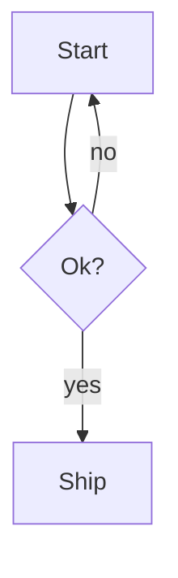

# Flow

```mermaid
graph TD; A[Start] --> B{Ok?}; B -->|yes| C[Ship]; B -->|no| A;
```

| Task | Owner | Done |
|---|---|---|
| Backfill | Dana | no |
| Flip read path | Sam | no |

Click a cell above and type. Press ⌥⌘P to print this page.
