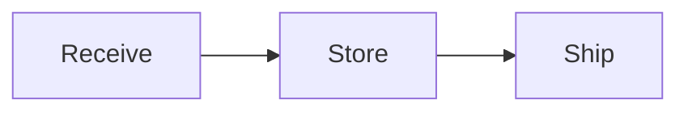

<!-- HTML comment: TODO document the REST API. FIXME: broken badge. -->

# Warehouse Inventory

[](https://example.com/ci) 
[![Coverage][cov-badge]][cov-link]

Setext heading level 1
======================

Setext heading level 2
----------------------

## Table of contents

1. [Overview](#overview)
2. [Install](#install)
   1. [From source](#from-source)
   2. [Docker](#docker)
3. [Usage](#usage)

## Overview

A paragraph with **bold**, __also bold__, *italic*, _also italic_, ***bold italic***, ~~strikethrough~~,
`inline code`, ``code with ` backtick``, <kbd>Ctrl</kbd>+<kbd>C</kbd>, H<sub>2</sub>O, x<sup>2</sup>,
and a hard line break at the end of this line  
followed by the next line. Escapes: \*not italic\*, \# not heading, \[not link\], 1\. not list.
Emoji shortcodes :package: :warning: and unicode: Zürich → 東京 ✓ 📦. Autolinks: <https://example.com>,
<ops@example.com>, https://example.com/bare-url, www.example.com. HTML entity: &copy; &amp; &lt;tag&gt; &#169;.

### Heading level 3
#### Heading level 4
##### Heading level 5
###### Heading level 6
#Not a heading (no space)
## Closed heading ##

## Lists

- Unordered item with dash
- Second item
  - Nested item
    - Deeply nested
  - Another nested
* Asterisk list
+ Plus list

1. Ordered item
2. Second
   - Mixed nesting
3. Third
10. Number jump

1) Parenthesis style
2) Second

- [ ] Task not done
- [x] Task done
- [X] Task done (capital)
  - [ ] Nested task

Term
: Definition list entry (extension)

- Item with paragraph

  Second paragraph in the item.

  ```sh
  echo "code inside a list item"
  ```

## Block quotes

> A quote with **formatting**.
>
> > Nested quote
> > continues here
>
> - List inside a quote
> - Second

> [!NOTE]
> A GitHub-style admonition.

> [!WARNING]
> Be careful with stock levels.

## Code

Indented code block:

    def reorder(qty):
        return qty < 25

Fenced blocks with info strings:

```python
def needs_reorder(qty: int, point: int = 25) -> bool:
    """Return True when stock is low."""
    return qty < point  # comment
```

```swift
struct Item: Codable { let sku: String; var quantity = 0 }
```

```json
{ "sku": "A-100", "qty": 5, "tags": ["small"], "ok": true, "none": null }
```

```bash
#!/usr/bin/env bash
for f in *.txt; do echo "$f"; done
```

~~~yaml
sku: A-100
tags: [small, fast]
~~~

````markdown
```nested
fence inside a longer fence
```
````

```diff
- old line
+ new line
```

```
no language specified
```

## Links and images

[Inline link](https://example.com "Title text") and [relative link](./docs/guide.md) and [anchor](#overview).
[Reference link][ref] and [collapsed][] and [shortcut] and [case-insensitive REF][REF].
 and ![Reference image][img].
<a href="https://example.com" target="_blank">HTML link</a>

[ref]: https://example.com/reference "Reference title"
[collapsed]: <https://example.com/collapsed>
[shortcut]: https://example.com/shortcut 'Single-quoted title'
[img]: images/stock.png
[cov-badge]: https://example.com/cov.svg
[cov-link]: https://example.com/coverage

## Tables

| SKU        | Quantity | Price (£) | Status      |
|:-----------|---------:|:---------:|-------------|
| WIDGET-100 |      250 |      2.50 | `in stock`  |
| GADGET-200 |        0 |     14.99 | **out**     |
| BOLT-M8    |   12,000 |      0.03 | [bulk](#x)  |

Left | Right
--- | ---
a | b

## Footnotes and extensions

Here is a footnote reference[^1] and another[^note].

[^1]: The first footnote.
[^note]: A longer footnote.

    With an indented paragraph.

Inline math $E = mc^2$ and display math:

$$
Q^* = \sqrt{\frac{2DS}{H}}
$$

Highlight ==marked text==, ^superscript^, ~subscript~, and an abbreviation: HTML.

*[HTML]: HyperText Markup Language

Mermaid diagram:



## Horizontal rules

---

***

___

## Raw HTML

<details>
<summary>Click to expand</summary>

Hidden content with **markdown** inside.

</details>

<div align="center">
  
  <p style="color: gray">Centered HTML block</p>
</div>

<script>console.log("raw script");</script>

## Configuration

Set `API_KEY=example-not-a-real-key` and connect to `192.0.2.10:8080` or `[2001:db8::1]:8080`.
Escape pipes in tables like `a \| b`. Line ending with backslash\
continues the paragraph.

Final paragraph with a trailing line break.

## Rare constructs

### Headings and rules

# ATX closing hashes #
## Heading with trailing hashes ##########
### Heading with `code`, *emphasis*, [link](#x) and trailing spaces   
#### Heading with attributes {#custom-id .class key=value}
Setext with *inline* markup
===========================
   Indented setext (up to three spaces)
   ---

* * *
- - -
_ _ _
 ***
  ---
   ___
**********

### Emphasis corners

snake_case_word, 2*3*4, **bold**text, **bold** *italic* ***both*** _**mixed**_ **_mixed_** *__mixed__* __*mixed*__
*emphasis with `code` and [link](#x)* and **bold with ~~strike~~** and ~~**strike bold**~~
*unclosed emphasis and \*escaped\* asterisks and a * lonely star
`` `backticks` `` and ``` `` double `` ``` and `` ` ``
Line one with trailing backslash\
line two after hard break, and two trailing spaces  
line three. <br> inline break. &nbsp;&nbsp;indent.

### Links and autolinks

<https://example.com/autolink> <mailto:ops@example.com> <ftp://example.com/file> <irc://irc.example.com/channel>
[Link with <angle> destination](<https://example.com/with spaces> "Title")
[Title in parens](https://example.com (Paren title)) [Empty]() [Anchor only](#) [Mail](mailto:ops@example.com)
[Nested [brackets] in text](https://example.com/a_(b)_c) [Escaped \] bracket](https://example.com)
[Ref with spaces] [Another Ref] [numeric ref][1] [ref][ ] ![alt text][img ref]
[full ref][Ref With Mixed CASE] [](https://example.com)
  
https://example.com/bare-autolink www.example.com/bare-www ops@example.com bare email
Wikilinks [[Page Name]] [[Page|alias]] [[Page#heading]] ![[embedded.png]] ![[note#^block]] and [[folder/note|alias]]
Mentions @username @org/team issue #123 org/repo#456 GH-789 commit a1b2c3d4 user@a1b2c3d4 
Citations [@knuth1984; @lamport1994, p. 33] and @knuth1984 and [-@knuth1984].

[Ref with spaces]: <https://example.com/ref with spaces>
[Another Ref]: https://example.com/another
   [1]: https://example.com/one  "Indented definition"
[img ref]: images/ref.png "Image ref"
[ref with mixed case]: https://example.com/mixed
[ref-with-title]: https://example.com/t
    "Title on next line"

### Lists in depth

3. Starts at three
4. Four
   * Bullet inside ordered
     1. Ordered inside bullet
        - Deepest
   * Second bullet

- Loose item one

- Loose item two
  continued lazily
continued lazy line

+ Plus item
  + Nested plus
- Dash after plus (new list)

1. One
1. One again
1. One again

0. Zero start
-1. Not a list

- [ ] Open task
  - [x] Done subtask
    - [ ] Deep open
- [-] Other state
- [!] Exclaim state

* Item with code block:

      indented code in item

* Item with quote:

  > quoted in item

  Followed by paragraph.

Definition term
: Definition one
: Definition two with *markup*

Term two
~ Tilde definition

### Block quotes and admonitions

> Quote line one
continues lazily
> > Nested
> > > Triple nested
>
> ```js
> code in quote
> ```
>
> | a | b |
> |---|---|
> | 1 | 2 |

> [!NOTE]
> Note callout
> [!TIP]+ Foldable open
> [!IMPORTANT]- Foldable closed
> [!WARNING]
> [!CAUTION]
> [!example] Custom type with title
> [!quote]
> [!bug]
> [!success]

!!! note "Python-Markdown admonition"
    Indented body of the admonition.

??? tip "Collapsible admonition"
    Hidden body.

???+ warning
    Open by default.

::: warning
VuePress / Docusaurus container
:::

:::note[Docusaurus title]
Body
:::

:::{note}
MyST directive style
:::

```{note}
MyST fenced directive
```


GitBook hint


### Code corners

```
bare fence
```

```js {highlight: [1, 3], title: "stock.js"} showLineNumbers
const a = 1;
```

```python title="app.py" {1,3-4}
x = 1
```

```diff-js
- old
+ new
```

``` c++
int main() {}
```

~~~~~~markdown
~~~
nested tilde
~~~
~~~~~~

    Indented code after a paragraph needs a blank line

<pre>
  html pre block
</pre>

Inline code with a `pipe | inside` and `` backtick ` inside `` and `<tag>`.

### Tables in depth

| Left | Center | Right | None |
|:-----|:------:|------:|------|
| `a\|b` | **bold** | [link](#x) | <br> |
| | empty cells | | |
| multi word | 日本語 | 1,000.50 | ✓ |

|No leading space|
|---|
|Single column|

Header | Only
-|-
cell | cell

### Inline extras

Footnotes^[Inline footnote text.] and [^long]: reference, plus H~2~O and 2^10^ and ==highlight== and ++inserted++ and ~~deleted~~ and --smart dashes-- and "smart quotes" and ... ellipsis.
Emoji :+1: :tada: :heart: :zap: :custom_emoji: and keyboard <kbd>⌘</kbd>+<kbd>K</kbd>, <mark>mark</mark>, <ins>ins</ins>, <del>del</del>, <abbr title="Title">ABBR</abbr>, <sup>sup</sup>, <sub>sub</sub>, <small>small</small>.
%%Obsidian comment%% and #tag #nested/tag #tag-with-dash and block id ^block-id
Math: $a^2 + b^2 = c^2$ and \(x\) and $`inline code math`$ and display:
$$
\begin{aligned} a &= b \\ c &= d \end{aligned}
$$
\[
\int_0^1 x\,dx
\]

[^long]: Footnote with multiple paragraphs.

    Second paragraph, indented.

    ```js
    code inside a footnote
    ```

*[ABBR]: Abbreviation definition
*[HTML]:   Another one with spaces

### Raw HTML and directives

<!-- Multi-line
     HTML comment -->
<?php echo "processing instruction"; ?>
<!DOCTYPE html>
<![CDATA[ cdata ]]>
<style>
  .x { color: red; }
</style>
<textarea>
  *not parsed*
</textarea>
<custom-element data-x="1" hidden>**not bold inside block**</custom-element>
<Component prop={value} />
 and <span style="color:red">span</span> and <a href="#x" title='single'>a</a>
<table><tr><td>

*Markdown inside HTML table cell (blank-line separated)*

</td></tr></table>

[TOC]
[[toc]]
[[_TOC_]]

{}body{}

{{ variable }} {{ escaped }}
@import "other.md"
!include other.md
<!-- prettier-ignore-start -->
| ignored | table |
<!-- prettier-ignore-end -->
<!-- markdownlint-disable MD013 -->
<!-- vale off -->
[comment]: # (hidden comment via link reference)
[//]: # "another hidden comment"

+++
title = "TOML front matter in the middle is just text"
+++

---
not: front matter in the middle
---

Line block (Pandoc):
| First line
| Second line
|   indented line

Pandoc div and spans:

::: {#id .class key="value"}
Content in a fenced div.
:::

[Bracketed span]{.smallcaps} and `code`{.python} and {width=50%} and [link](x){target=_blank}

Final line without trailing newline issues, with Zürich → 東京 ✓ 📦 and a non-breaking space between words.
